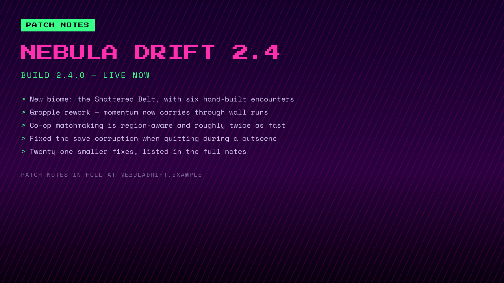
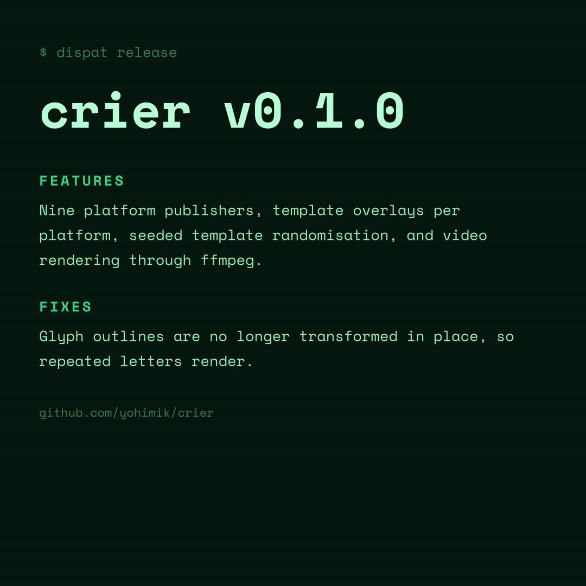
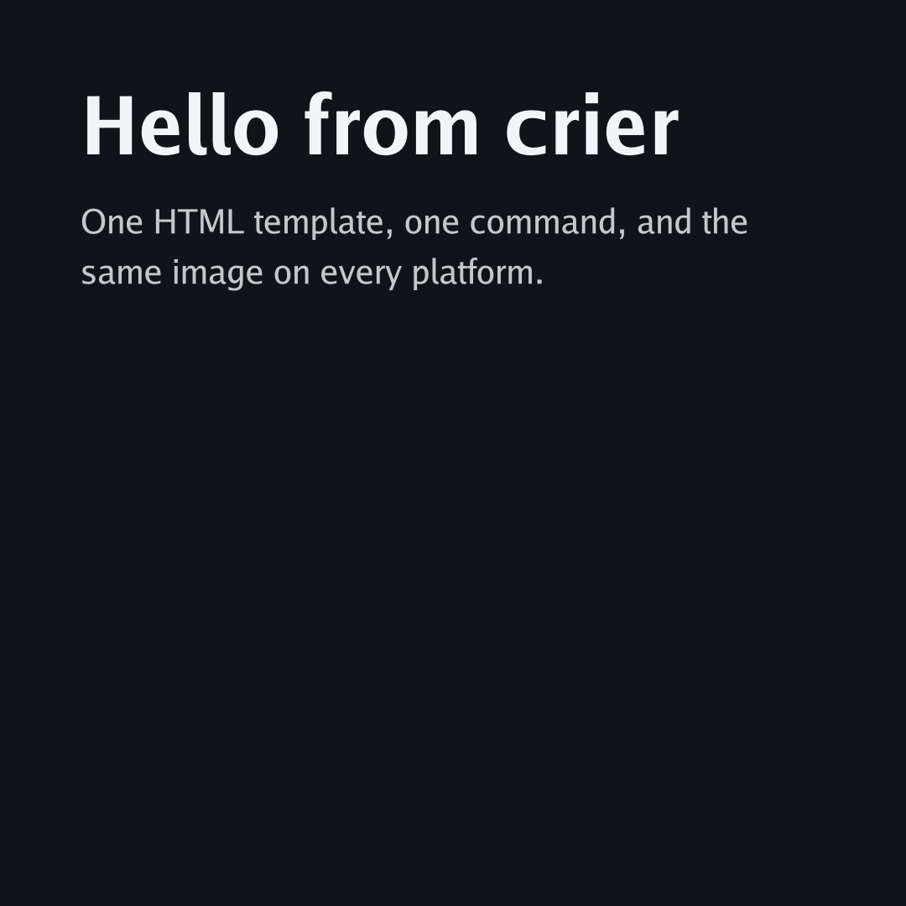
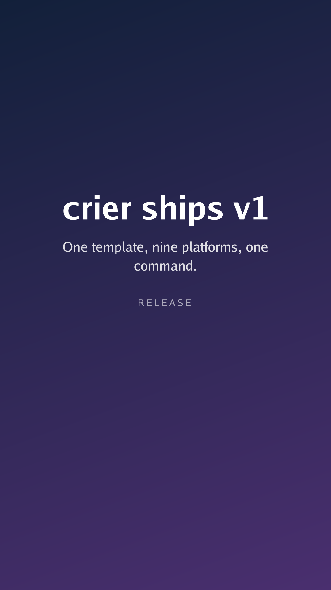

# crier

Render an HTML template to an image or a video, and publish it to ten social platforms with one command.

```sh
cd my-project && crier
```

Provide one layout, one data file, and one config. Instagram gets a story, Discord gets a card, and everyone gets the caption written for them.

crier finds the configuration by walking up from where you are. It works the way git finds a repository. Publishing is what it does with no arguments. So the everyday flow is: change directory, run `crier`.

- **Ten platforms.** Instagram, Facebook, TikTok, Telegram, X, Mastodon, Discord, LinkedIn, Reddit, and Slack. Publish images, video, and animated GIFs. You can also use any shell script you like as a [platform of your own](./docs/publishing/custom.md).
- **HTML and CSS you already know.** Use gradients, web fonts, SVG, and blend modes. They are laid out by a pure-Go engine and painted by a rasterizer written for it. There is no headless browser.
- **One layout, many shapes.** Use template overlays and per-platform sizes. One card becomes a story and a banner without a second template.
- **Configuration that composes.** Set every value in a file, an environment variable, or a flag. The file is found by walking up from where you are, the way git finds a repository.
- **A track with the post.** Attach [an audio file you have the rights to](./docs/publishing/music.md) at Discord, Slack and Telegram, or let TikTok pick one. Open an Instagram carousel or a Telegram album with a video, which is the only way a soundtrack reaches Instagram. No API anywhere names a licensed track, and the page says so rather than leaving you to search.
- **A single static binary.** Built with `CGO_ENABLED=0` for six platforms. There is nothing to install alongside it.

## Install

### Install script

macOS and Linux:

```sh
curl -fsSL https://raw.githubusercontent.com/yohimik/crier/main/install.sh | sh
```

Windows:

```powershell
irm https://raw.githubusercontent.com/yohimik/crier/main/install.ps1 | iex
```

The script resolves the latest stable release. It verifies the download against the sha256 digest GitHub publishes for it. It installs to `/usr/local/bin` when that is writable, or `~/.local/bin` otherwise. Pin a version with `CRIER_VERSION`. Choose the directory with `CRIER_BIN_DIR`.

### dispat install

```sh
dispat install yohimik/crier
```

The crier releases name their binaries the way the dispat installer expects. They use the repository's name and the platform. This means the bare command works on its own. You need dispat 1.7 or newer. An older dispat requires `--asset 'crier-{os}-{arch}'`.

Before the first stable release, add `--prerelease`. Release candidates are prereleases, and `dispat install` skips those by default:

```sh
dispat install yohimik/crier --prerelease
```

### GitHub Actions

```yaml
- uses: yohimik/crier@v1
- run: crier
```

The action installs crier and puts it on `PATH`. It takes `version` (default: the latest stable), `bin-dir` and `github-token`. It reports `version` and `path`.

**`@v1` appears with the first stable release.** It is a moving tag scoped to the stable line. A release candidate never drags it forward, which means it does not exist yet. Until then, pin the full tag:

```yaml
- uses: yohimik/crier@v1.0.0-rc.0
```

More: [installing](./docs/operations/install.md#github-actions).

### go install

```sh
go install github.com/yohimik/crier/cmd/crier@latest
```

This builds from source and needs Go 1.26 or newer. The binary reports the module version rather than the one stamped at release time. Released binaries carry the version, the commit and the build date in their ldflags. A `go install` build reads what it can from the module's own build info instead. Everything else is identical.

`@latest` follows Go's prerelease rule and skips release candidates. Name one explicitly during the rc period.

### Keeping it up to date

```sh
crier self-update            # verified against GitHub's digest, and reversible
crier self-update --rollback # within a week of an update
```

More ways, and what each does: [installing](./docs/operations/install.md).

## Quickstart

```sh
mkdir promo && cd promo
crier init          # writes a commented crier.yaml to edit
```

The `crier init` command names a template and a data file. You need to write them.

`template.html`:

```html
<!doctype html>
<html><head><style>
  html, body { height: 100%; margin: 0 }
  body { font-family: "Go", sans-serif }
  .card {
    width: 100%; height: 100%; box-sizing: border-box; padding: 96px;
    background: linear-gradient(160deg, #12203a, #4a2f6f); color: #fff;
  }
  h1 { font-size: 96px; margin: 0 }
  p  { font-size: 40px; opacity: .8 }
</style></head>
<body><div class="card">
  <h1>{{ .title }}</h1>
  <p>{{ .subtitle }}</p>
</div></body></html>
```

`data.yaml`:

```yaml
title: crier ships v1
subtitle: One template, ten platforms, one command.
```

Next, fill in the `crier.yaml` file. The `init` command already created it.

```yaml
render:
  template: template.html
  data: data.yaml
  width: 1080
  height: 1080
  output: card.png
  hermetic-fonts: true

publish:
  caption: "{{ .title }} — {{ .subtitle }}"
  telegram:
    enabled: true
    chat-id: "@my_channel"
```

Then run this command:

```sh
export CRIER_PUBLISH_TELEGRAM_TOKEN=…

crier render      # 1. see the picture: card.png, no network
crier ping        # 2. are the credentials right? nothing is posted
crier --dry-run   # 3. what would be sent, still no network
crier             # 4. post it
```

### Or straight from the environment

You can use the same template without a data file. Point `render.data` at a prefix. Every variable with that prefix becomes a value.

```yaml
# crier.yaml
render:
  template: template.html
  data: env:CARD_
  width: 1080
  height: 1080
  output: card.png
```

```sh
CARD_TITLE="crier ships v1" \
CARD_SUBTITLE="One template, ten platforms, one command." \
  crier render
```

For example, `CARD_TITLE` becomes `{{ .title }}` and `CARD_MAIN_TITLE` becomes `{{ .main_title }}`. The tool strips the prefix, converts the rest to lower-case, and keeps the underscores. These values are plain strings exactly as you write them. If your data has structure, you still need a file or the `--render-data -` flag. Read [the data document](./docs/templates/README.md#the-data-document) for more details.

You can find every option and its default value in [`crier.example.yaml`](./crier.example.yaml). This file shows all options at a glance. You can also run `crier init --full` to write this exact configuration into your own directory.

## Examples

Each example is a complete project. Run the command to get the image. All previews below were rendered by crier itself.

| | Example | Demonstrates |
| --- | --- | --- |
|  | **[business-promo](./examples/business-promo/)** · 1080×1080<br>[`template.html`](./examples/business-promo/template.html) · [`crier.yaml`](./examples/business-promo/crier.yaml)<br>`crier render --config examples/business-promo/crier.yaml` | Bundled font (Poppins), linear gradient, [line-clamp overflow](./docs/templates/text-overflow.md), caption templating |
|  | **[video-game-release](./examples/video-game-release/)** · 1920×1080<br>[`template.html`](./examples/video-game-release/template.html) · [`story-overlay.html`](./examples/video-game-release/story-overlay.html) · [`crier.yaml`](./examples/video-game-release/crier.yaml)<br>`crier render --config examples/video-game-release/crier.yaml` | [Per-platform overlays](./docs/templates/overlays.md): an Instagram story from the same layout. Pixel display font, repeating gradient |
|  | **[social-quote](./examples/social-quote/)** · 1200×675<br>[`template-serif.html`](./examples/social-quote/template-serif.html) · [`template-panel.html`](./examples/social-quote/template-panel.html) · [`crier.yaml`](./examples/social-quote/crier.yaml)<br>`crier render --config examples/social-quote/crier.yaml` | [Template pool and seeded randomisation](./docs/templates/pools.md), serif face, radial gradient, alt text |
|  | **[release-changelog](./examples/release-changelog/)** · 1080×1080<br>[`template.html`](./examples/release-changelog/template.html) · [`announce.sh`](./examples/release-changelog/announce.sh) · [`crier.yaml`](./examples/release-changelog/crier.yaml)<br>`crier render --config examples/release-changelog/crier.yaml` | A release posting about itself: [dispat](https://dispat.dev) release variables piped in on stdin. Monospace face, scanline pattern |
|  | **[event-invite](./examples/event-invite/)** · 1080×1920<br>[`template.html`](./examples/event-invite/template.html) · [`crier.yaml`](./examples/event-invite/crier.yaml)<br>`crier render --config examples/event-invite/crier.yaml` | Story format, rounded face, duotone gradient |
|  | **[custom-platform](./examples/custom-platform/)** · 1080×1080<br>[`template.html`](./examples/custom-platform/template.html) · [`publish.sh`](./examples/custom-platform/publish.sh) · [`crier.yaml`](./examples/custom-platform/crier.yaml)<br>`crier render --config examples/custom-platform/crier.yaml` | [A shell script as a platform](./docs/publishing/custom.md): curl to a webhook. Geometric sans over mono, layered radial background |
|  | **[square-1080](./examples/square-1080/)** · 1080×1080<br>[`template.html`](./examples/square-1080/template.html) · [`crier.yaml`](./examples/square-1080/crier.yaml)<br>`crier render --config examples/square-1080/crier.yaml` | The smallest useful project: no bundled fonts, no overlays |
|  | **[story-1080x1920](./examples/story-1080x1920/)** · 1080×1920<br>[`template.html`](./examples/story-1080x1920/template.html) · [`crier.yaml`](./examples/story-1080x1920/crier.yaml)<br>`crier render --config examples/story-1080x1920/crier.yaml` | A story starter with `{{ block }}` sections ready for overlays |

The examples bundle OFL-licensed fonts. These live in [`examples/fonts/`](./examples/fonts/). Each font includes its licence.

## Commands

| | |
| --- | --- |
| `crier` | render and post to every enabled platform; publishing is the default |
| `crier render` | render the template and write the file |
| `crier ping` | check every enabled platform's credentials, without posting |
| `crier platforms` | which platforms are enabled, and which are configured |
| `crier config` | the resolved configuration, secrets redacted |
| `crier init` | write a configuration file to start from (`--full` for every option) |
| `crier self-update` | replace this binary with the newest release (`--rollback` undoes it) |
| `crier --version` | the version, the commit and the build date |

The `crier publish` command is the default. You can leave it out. For example, `crier --dry-run` and every other flag work without it. You will find the full list and the dispatch rule in [the command line](./docs/operations/cli.md).

Results go to standard output. Logs go to standard error. The [exit code](./docs/operations/exit-codes.md) tells you what happened.

## Documentation

[The index](./docs/README.md) links everything. These are the pages people reach for first:

- [Configuration](./docs/configuration/README.md): how the three layers compose, how the file is found, and every key.
- [Writing templates](./docs/templates/README.md), [overlays](./docs/templates/overlays.md), [captions](./docs/templates/captions.md), [text overflow](./docs/templates/text-overflow.md), and [fonts](./docs/templates/fonts.md).
- [CSS support](./docs/rendering/css-support.md): what the engine implements.
- [Pagination and carousels](./docs/rendering/pagination.md): long content across several pages, and the posts they become.
- [Publishing](./docs/publishing/README.md): includes a page per platform.
- [Staging](./docs/staging/README.md): the public URL Instagram insists on.

## Requirements

You do not need anything for images. You need [ffmpeg](./docs/rendering/video.md) for video, and [ngrok or zrok](./docs/staging/tunnels.md) for a tunnel. You only need them when you use those features.

## Changelog

The changelog is in [`cmd/crier/CHANGELOG.md`](./cmd/crier/CHANGELOG.md). [dispat](https://dispat.dev) writes it from the conventional commits. See [releasing](./docs/operations/release.md).

## Contributing

Read the [Development](./docs/operations/development.md) guide. It covers building the project. It also explains the two test suites, the golden images, and the commit convention.

## Licence

This project uses the MIT licence. See the [LICENSE](./LICENSE) file for details.
